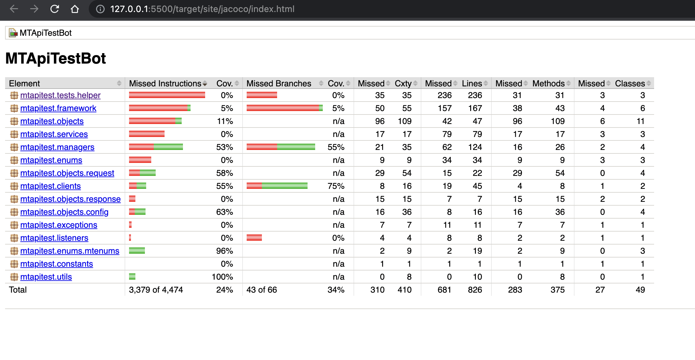

# MT API test automation framework

## PRE-REQUISITES
* Java jdk-11
* Node 12+ (For allure reports)
* Eclipse or IntelliJ IDE

## SETUP

* Clone the repo
* Import into the IDE of your preference and build the project.
* Setup lombok plugin in your IDE. You can install the plugin from market place in eclipse and Plugins tab in IntelliJ.
* Install allure node package using npm - `sudo npm i -g allure-commandline`.
* Run the build.sh which will clean install all dependencies and also install the `pre-commit hooks` for unit tests
* To run test ` mvn test -DsuiteXmlFile=service-test.xml`
* Allure reports will be generated for each run. To fetch html report, run `allure serve allure-results`

* The code coverage for tests can be fetched from `target/site/jacoco/index.html`



## FRAMEWORK SPECIFICATION

* Core framework is built over an http client library `RestAssured`, a library commonly used for writing tests for Restful API's.
* `RequestBuilder` provides a wrapper to create request in a simplified manner. RequestBuilder uses `Builder pattern`.
* Request and response constructions are done using object serialisation and deserialisation with the help of `Jackson` object mapper.
* The POJO classes all implement builder pattern at runtime using `Lombok`.
* `MTTestFramework` acts as the base for the all the entities in the framework.
* `BaseTest` is the entry point for tests.
* `Service` classes are responsible for only building the request context, making request and returning a response.
    ```java
    public Response createUserWithArray(String requestBody) throws Exception {
		log.info("Calling createUserWithArray...");
		Endpoint endpoint = this.configHelper.getServiceEndpoint(this.serviceConfig, MTServiceEndpoint.CREATEUSER);
		RequestSpecification request = reqBuilder.builder().setBaseURI(this.protocol + "://" + this.host)
			.setEndpoint(endpoint.getPath()).setHeaders(defaultHeaders).setBody(requestBody)
			.setMethod(endpoint.getMethod()).buildRequest();
		return reqBuilder.sendRequest(request);
	}
    ```
* `TestHelpers` are responsible for calling managers, data providers, assertions managers and payload serialization/deserialzation.
* `DataProvider` is responsible for providing data to the test helper.
* `EntityMapper` is used for payload serialization/deserialzation.
* `DataDrivenmanager` is responsible to load the data from test-data source. Currently implemented for excel.
* All assertions are made via `AssertionManager`
* Tests are written in their respective test classes and the test suites are maintained testng xml configs.
* We can run single or multiple tests from the suite using their test caseId. `TestTransformerListener` helps identify and execute selected cases.
* The request contexts are maintained in the config.xml file. `ConfigManager` is responsible for the providing the configs to the service class and test helpers.
* `Allure reports` are generated for each test run and it provides a detailed html report.
* `UnitTests` are maintained in a separate suite and the suite is triggered on every commit using `git pre-commit hook`
* Unit tests, validates the framework's managers, dataproviders and utility classes which are vulnerable to changes and could lead to failures. The pre-commit hook prevents user from committing the code changes if there are unit test failures. However, it can be bypassed using `-nm` instead of `-m` when committing code.
* Code coverage report is generated using `JaCoCo plugin`.

## Test case files :
* `src/test/java/mtapitest/tests/user/UserHappyPathTests.java` contains all happy path smoke tests for user endpoint.
* `src/test/java/mtapitest/tests/user/UserNegativeTests.java` contains all negative tests for user endpoint.
* `src/test/java/mtapitest/tests/user/UserDataDrivenTest.java` contains a data driven test case to test CRUD operations on user endpoints.
* `src/test/java/mtapitest/tests/pet/PetHappypathTests.java` contains all happy path smoke tests for pet endpoint.
* `src/test/java/mtapitest/tests/user/PetNegativeTests.java` contains all negative tests for pet endpoint.

## Unit test files :
* `src/test/java/mtapitest/unittests/ConfigTest.java` contains unit tests for ConfigManager.
* `src/test/java/mtapitest/unittests/DataDrivenManagerTest.java` contains unit tests for DataDrivenManager.
* `src/test/java/mtapitest/unittests/DataProviderTest.java` contains unit tests for DataProvider.
* `src/test/java/mtapitest/unittests/UtilsTest.java` contains unit tests for CommonUtils.